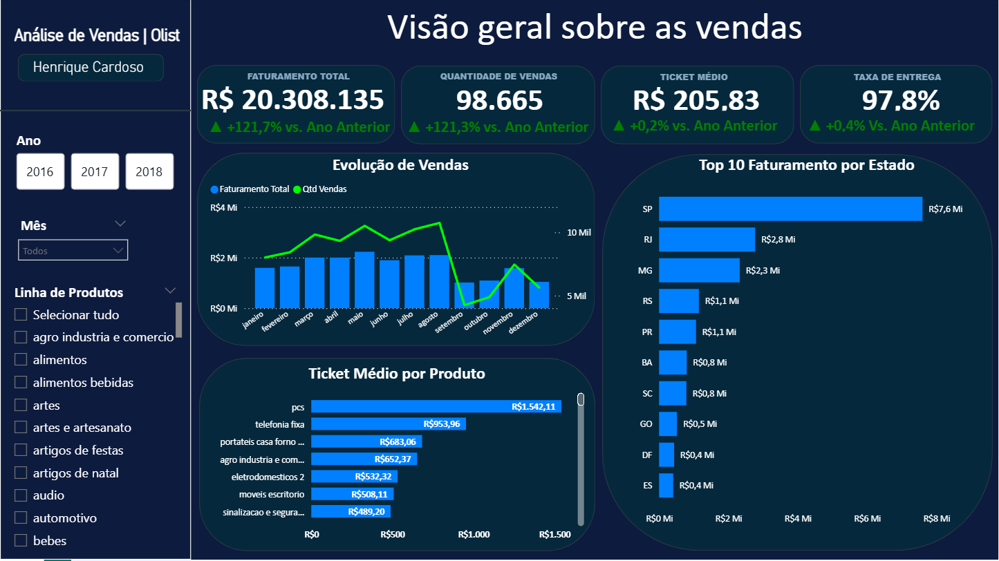

# Análise de Vendas — E-commerce Olist

Análise exploratória de 100 mil pedidos reais de e-commerce brasileiro (2016–2018).  
Projeto desenvolvido para portfólio de Analista de Dados Júnior.

## Dashboard



**Principais números (2016–2018):**
- Faturamento total: **R$ 20.308.135**
- Quantidade de vendas: **98.665**
- Ticket médio: **R$ 205,83**
- Taxa de entrega: **97,8%**

## Tecnologias utilizadas

- **Python + Pandas** — limpeza e preparação dos dados
- **SQL (SQLite)** — análise exploratória com perguntas de negócio
- **Power BI** — dashboard interativo com KPIs, evolução de vendas, ticket médio por produto e faturamento por estado

## Dataset

[Brazilian E-Commerce Public Dataset by Olist](https://www.kaggle.com/datasets/olistbr/brazilian-ecommerce)  
100 mil pedidos reais entre 2016 e 2018, com 9 tabelas cobrindo pedidos, produtos, clientes, vendedores, pagamentos e avaliações.

## Perguntas de negócio respondidas

| # | Pergunta | Insight principal |
|---|---|---|
| 1 | Quais as 10 categorias mais vendidas? | `cama_mesa_banho` lidera com 11.650 vendas |
| 2 | Quais os 10 clientes que mais gastaram? | Top cliente: R$ 109.312 em compras |
| 3 | Qual mês teve maior faturamento? | Novembro/2017: R$ 1,55 milhão |
| 4 | Quais os 10 vendedores com maior ticket médio? | Até R$ 4.400 por pedido (mín. 10 pedidos) |
| 5 | Qual estado tem mais pedidos? | SP: 40.500 pedidos (34,5% do total) |
| 6 | Qual forma de pagamento mais usada? | Cartão de crédito: 72,2% dos pedidos |
| 7 | Qual a nota média de avaliação por categoria? | Análise de satisfação por produto |
| 8 | Qual a performance de entrega? | % pedidos entregues no prazo vs atrasados |

## Como reproduzir

**Pré-requisito:** baixar o dataset do Kaggle e extrair os CSVs em `data/raw/`

```bash
# 1. Clonar o repositório
git clone https://github.com/henriquec0889/analise-vendas-olist.git
cd analise-vendas-olist

# 2. Instalar dependências
pip install -r requirements.txt

# 3. Rodar os notebooks em ordem (VS Code + extensão Jupyter)
#    notebooks/01_limpeza.ipynb  → gera data/processed/olist_limpo.csv
#    notebooks/02_analise_sql.ipynb → responde as 8 perguntas de negócio
```

## Estrutura do projeto

```
analise-vendas-olist/
├── data/
│   ├── raw/         → CSVs originais do Kaggle (não versionados — arquivo grande)
│   ├── processed/   → Dados limpos gerados pelo notebook 01 (não versionados)
│   └── external/    → Dados externos (dicionário, traduções)
├── notebooks/
│   ├── 01_limpeza.ipynb       → Limpeza, merge de 7 tabelas e exportação
│   └── 02_analise_sql.ipynb   → 8 perguntas de negócio respondidas em SQL
├── sql/
│   └── queries_negocio.sql    → Queries documentadas para uso no DBeaver
├── images/
│   └── DashboardOlist.png     → Screenshot do dashboard Power BI
├── requirements.txt           → Dependências Python
└── README.md
```

---

> Os arquivos de dados não são versionados por questão de tamanho.  
> O código nos notebooks é suficiente para reproduzir toda a análise a partir dos CSVs originais do Kaggle.